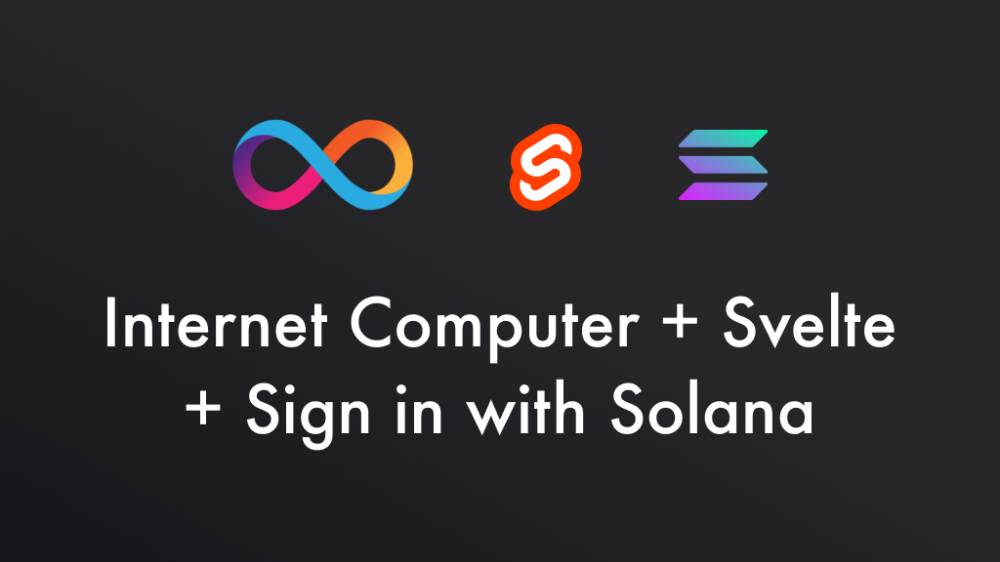

## Overview

This repository is a Svelte + Vite application and template that demonstrates how to authenticate
users with Sign‑In‑With‑Solana (SIWS) to an Internet Computer (IC) canister. By combining:

- **[Solana wallet-adapter](https://github.com/anza-xyz/wallet-adapter)**: Provides Solana wallet connections, wallet connectio UI, etc.
- **[ic-siws-js](https://www.npmjs.com/package/ic-siwe-js)**: SIWS authentication package, supporting Vanilla TS, React, Vue and Svelte.
- **[ic_siws_provider](https://github.com/kristoferlund/ic-siws/tree/main/packages/ic_siws_provider)**: Pre-built canister to add SIWS authentication support to ICP projects.

you get a fully authenticated cross‑chain dapp where a Solana wallet maps one‑to‑one to an IC identity.

> [!NOTE]
> In addition to this Svelte demo of ic-siws, there are versions for Vue, React, and more in the main [ic-siws](https://github.com/kristoferlund/ic-siws) repository.

### Highlights

- Sign in with Solana to interact with IC canisters
- One‑to‑one mapping between Solana wallet and IC identity
- Leverage IC features: BTC/ETH integration, fast finality, low transaction fees, HTTPS outcalls, cheap data storage

## Live Demo

Try it live: <https://ghe6p-faaaa-aaaal-qsm3q-cai.icp0.io>

## App components

If you are new to IC, please read the [Internet Computer Basics](https://internetcomputer.org/basics) before proceeding.

This app consists of two main components:

### Frontend

The frontend is a Svelte application served by an ICP asset canister. In a real world scenario, this frontend application would make authenticated calls to one or more application canisters. Such application canisters are not included with this demo.

### IC SIWS Provider

The pre-built IC SIWS Provider is used to create an identity for the user. It is a Rust based canister that implements the SIWS login flow. The flow starts with a SIWS message being generated and ends with a Delegate Identity being created for the user. The Delegate Identity gives the user access to the backend canister.

## How it works

This is the high-level flow between the app components when a user logs in:

1. The application requests a SIWS message from the `ic_siws_provider` canister on behalf of the user.
2. The application displays the SIWS message to the user who signs it with their Solana wallet.
3. The application sends the signed SIWS message to the `ic_siws_provider` canister to login the user. The canister verifies the signature and creates an identity for the user.
4. The application retrieves the identity from the `ic_siws_provider` canister.
5. The application can now use the identity to make authenticated calls to the app canister.

## Run locally

```bash
dfx start --clean --background
make create-canisters 
make deploy-provider
make run-frontend
```

> [!NOTE]
> The `run-frontend` script starts a Vite server that serves the frontend application. The Vite server will automatically reload the application when you make changes to the frontend code. 
>
> The provider canister is configured to use the Vite server as the domain for the SIWS login flow. If you are running the frontend on a different domain, you need to change the `domain` parameter in the `Makefile` before deploying the provider canister. The default configuration specifies `domain = "localhost:5173"`. This is the default domain for the Vite development server.
> 
> Learn more about these settings in the [ic-siws](https://github.com/kristoferlund/ic-siws) repository. 

## Details

For more details on how to use SIWS with your ICP project, see https://github.com/kristoferlund/ic-siws/tree/main/packages/ic_siws_js

## Updates

See the [CHANGELOG](CHANGELOG.md) for details on updates.

## Contributing

Contributions are welcome. Please submit your pull requests or open issues to propose changes or report bugs.

## License

This project is licensed under the MIT License. See the LICENSE file for more details.
